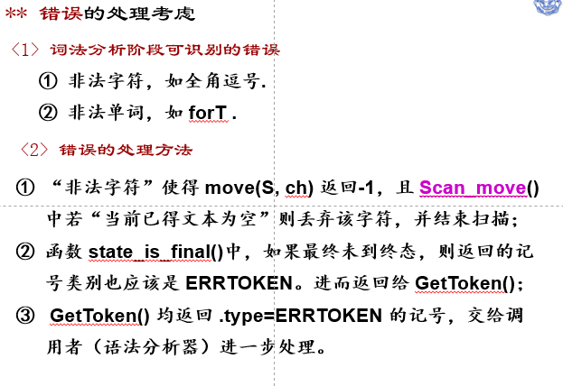

* C 
* RUST
* Python


* lex / yacc

# 词法分析

* letter = [a-zA-Z_]
* digit = [0-9]
* 常数：CONST_ID : `digit+("."digit*)?` 有属性值
  * `PI`
  * `E`
* 注释：COMMENT `"//"|"--"`
* 关键词：
  * `ORIGIN`
  * `SCALE`
  * `ROT`
  * `IS`
  * `FOR`
  * `T`
  * `FROM`
  * `TO`
  * `STEP`
  * `DRAW`
  * `FUNC` :有属性地址
    * `SIN`
    * `COS`
    * `TAN`
    * `LN`
    * `EXP`
    * `SQRT`
* 分隔符
  * SEMICO `;`
  * L_BRACKET  `(`
  * R_BRACKET  `)`
  * COMMA `,`
* 运算符
  * PLUS `+`
  * MINUS `-`
  * MUL `*`
  * DIV `/`
  * POWER `**`
* 空：
* 空记号：NONTOKEN
* 出错记号：ERRTOKEN

|  记号种别  |  正规式  | 属性值 | 函数地址 |
| :--------: | :----: | :----: | :------: |
|  CONST_ID  |  "PI"  | **3.1415926** |          |
|  CONST_ID  |  "E"   | **2.71828** |          |
|  COMMENT   | `"//"|"--"` |        |          |
|  **FUNC**  | "SIN"  |        | sin |
|  **FUNC**  | "COS"  |        | cos |
|  **FUNC**  | "TAN"  |        | tan |
|  **FUNC**  |  "LN"  |        | log |
|  **FUNC**  | "EXP"  |        | exp |
|  **FUNC**  | "SQRT" |        | sqrt |
|            |        |        |          |
| **ORIGIN** |        |        |          |
| **SCALE**  |        |        |          |
|  **ROT**   |        |        |          |
|   **IS**   |        |        |          |
|  **FOR**   |        |        |          |
| T | | | |
|  **FROM**  |        |        |          |
|   **TO**   |        |        |          |
|  **STEP**  |        |        |          |
|  **DRAW**  |        |        |          |
|            |        |        |          |
| SEMICO    | ; |      |      |
| L_BRACKET | ( |      |      |
| R_BRACKET | ) |      |      |
| COMMA     | , |      |      |
|           |      |      |      |
| PLUS      | + |      |      |
| MINUS     | - |      |      |
| MUL       | * |      |      |
| DIV       | / |      |      |
| POWER     | ** |      |      |
|           |      |      |      |
| NONTOKEN | | | |
| ERRTOKEN | | | |

* 疑问：ID是否多余


# 语法分析

## 语法

```
Program: Program Statement 
```


# 语义分析

构造语法树

* 树节点：
  * Token种别: CONST_ID, PLUS, MINUS, MUL, DIV, POWER, FUNC,T
  * 若为常数
    * 只记录常数的值
  * 若为操作符
    * 构造左右子树
  * 若为函数
    * 构造子树
    * 记录函数地址
  * 若为参数
    * 记录参数地址

* 对每个Expression构造语法树MakeExprNode(TOKEN, ...)
  * CONST_ID
    * 
* 对每个Statement算出需要的绘图参数值
  * 


# 基于lex / yacc

参考：

[Lex使用指南 - 火雨(Nick) - 博客园 (cnblogs.com)](https://www.cnblogs.com/wp5719/p/5528896.html)

[(84条消息) 手把手教程-lex与yacc/flex与bison入门（一）（使用windows环境）_D-Cierra的博客-CSDN博客_flex和bison入门](https://blog.csdn.net/weixin_44007632/article/details/108666375)

## 词法分析

* flex
  * -i 使得大小不敏感


## 语法分析

* bison
* 输出语法树
  * [(88条消息) printf 输出多个空格的方法_Shirley-hh的博客-CSDN博客_如何用printf输出空格](https://blog.csdn.net/weixin_52167761/article/details/117713837?spm=1001.2101.3001.6650.1&utm_medium=distribute.pc_relevant.none-task-blog-2~default~CTRLIST~default-1.highlightwordscore&depth_1-utm_source=distribute.pc_relevant.none-task-blog-2~default~CTRLIST~default-1.highlightwordscore)

* 如何输出token字符串
  * 创建一个字符串数据


## 语义分析

* 导致段错误
  * 忘记在语义动作中将 创建的节点地址给 $$
  * TravelTree中 忘记break

## 基本功能

### 绘图

* 变换顺序总是：比例变换→旋转变换→平移变换 
* 用vector+plot画图
* C++特性：引用传值
* 粗心：忘加; 导致error提示的地方不对


**问题：**

* terminate called after throwing an instance of 'std::out_of_range'
    what():  vector::_M_range_check: __n (which is 200) >= this->size() (which is 200)
  Aborted
  * n+1个元素空间


### 错误处理




* 行号：全局变量


## 附加功能

* [x] 对逻辑坐标系重新定义，与习惯上的坐标系一致；
* [ ] 扩充语句类型，如允许用户
  * [x]    规定 图形颜色、
  * [ ] 规定 点的大小、
  * [ ] 定义/引用变量等；
* [ ] 增加文本框，使得用户可以在图形中添加文字说明；
* [x] 增加清图功能，使得图形可以具有简单的动画效果。 

### 指定线条颜色和样式

**颜色：**


```
"r"
"g"
"b"
```


样式：

```
'-'       solid line style
'--'      dashed line style

':'       dotted line style
```

* 分析
  * COLOR
  * IS
  * ColorChoice
    * RED
    * GREEN
    * BLUE
    * RANDOM
* 分析：
  * LINE
  * IS
  * LineChoice
    * SOLID
    * DASHED
    * DOTTED

* 创建全局变量
  * color: 默认BLACK
  * linestyle: 默认SOLID

### 清图功能

* 增加TOKEN
  * 种别：CLEAR
  * 关键词

### 动图功能

* 


## 会用CMake


**问题：**

* multiple definition of `token'; /tmp/ccPN24xx.o:(.bss+0x40): first defined here

  * extern "C"{

    * extern Token token
    * }

  * extern "C"{

    ​    extern int **yylex**(void);

    ​    int **yywrap**(void);  

    ​    void **yyerror**(const char *str);

    ​    extern FILE* yyin;

    ​    extern FILE* yyout;      

    }


## WSL2下

* xrdp
* xfce4


* 运行：`sudo /etc/init.d/xrdp start `
  * `ip a`


**安装python3.8和pip3**

* 依赖问题：
  * ==注意换源的ubuntu版本==
  * 不要找到一个换源方法就复制粘贴

**问题：**

* display 0
  * win远程连接的凭证是wsl2中的root用户和密码
  * 忘记了WSL2中root用户的密码
* hello.py:12: UserWarning: Matplotlib is currently using agg, which is a non-GUI backend, so cannot show the figure.
    plt.show()
  * python的绘图库，比如常用的matplotlib，在WSL中会默认使用Agg绘图后端。这是一个哑终端，不做GUI输出，但是可以保存绘制的图形到文件。
  * 使用PyQt [(88条消息) 解决“UserWarning: Matplotlib is currently using agg, which is a non-GUI backend....”_lk66lk的博客-CSDN博客](https://blog.csdn.net/lk66lk/article/details/117756479)


## 借助Python的matplotlib

* 直接使用matplotlib-cpp项目
* 学会使用CMake
  * 只能编译连接cpp
  * [(88条消息) CMAKE学习——编译多个文件 & 多个目录_dyyzlzc的博客-CSDN博客_cmake多目录编译](https://blog.csdn.net/dyyzlzc/article/details/105189374)


## 遇到的问题

* lex前导空白
* 语法不完整：FOR
* C/C++调用Python绘画：matplotlib-cpp项目
  * 基于C++调用Python的方法将matplotlib封装了一层
  * Windows:
    * [c++调用matplotlib(一) - 芒果的博客 - 芒果的个人博客 (mangoroom.cn)](https://mangoroom.cn/cpp/call-matplotlib-on-cpp.html)
    * 安装cmake
  * Linux:
    * 
* [(87条消息) [Ubuntu\]Could NOT find PythonLibs_倒霉茄子的博客-CSDN博客](https://blog.csdn.net/u011816873/article/details/74907978)
* #define YYSTEPE 
  * yylval使用
  * $也使用了
* 写struct和union的时候，把变量和类型搞混了
* va在这里是variable-argument(可变参数)的意思.这些宏定义在stdarg.h中,所以用到可变参数的程序应该包含这个头文件.
* 遭遇段错误：**printf**("%d\n",$1->TokenType);
  * 解决：不能这样用，
    * extern struct Token token;  
    * token.value
  * [(87条消息) 解决Program received signal SIGSEGV, Segmentation fault.的辛酸_QuanQuanYuanXin的博客-CSDN博客_program received signal sigsegv](https://blog.csdn.net/QuanQuanYuanXin/article/details/52883895)
  * `#define **YYSTYPE** struct ExprNode * `
  * [Flex Bison Segmentation Fault in C - Stack Overflow](https://stackoverflow.com/questions/18433204/flex-bison-segmentation-fault-in-c)
* enum tokentype OpCode
  * error: field ‘OpCode’ has incomplete type
  * 有定义，但是所在头文件没有被包含文件A中，仅仅在A中声明了，也属于不完整类型
  * 使用强制类型转换吧
* 一元负号的优先级和右结合
  * 怎么在语法树中表示
* 求表达式的值？
  * switch
  * 递归
* lex.yy.cpp:590:16: error: conflicting declaration of ‘int yywrap()’ with ‘C’ linkage
  scanner.l:11:12: note: previous declaration with ‘C++’ linkage
  * 在C++环境下使用C函数的时候，常常会出现编译器无法找到obj模块中的C函数定义，从而导致链接失败的情况，这是因为C++语言在编译的时候为了解决函数的多态问题，会将函数名和参数联合起来生成一个中间的函数名称，而C语言则不会，因此会造成链接时找不到对应函数的情况，此时C函数就需要用extern “C”进行链接指定，这告诉编译器，请保持我的名称，不要给我生成用于链接的中间函数名。


